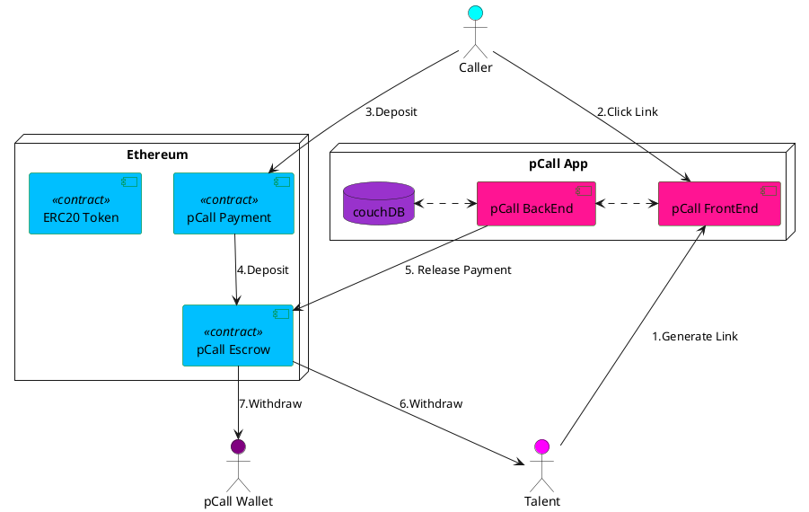

## Successful Call

```plantuml
@startuml
'skinparam linetype ortho
skinparam databaseBackgroundColor DarkOrchid
skinparam component {
  borderColor Green
  backgroundColor DeepPink
  backgroundColor<<contract>> DeepSkyBlue
}

actor Talent #Fuchsia
actor Caller #Cyan
actor "pCall Wallet" #Purple

node "pCall App" {
[pCall FrontEnd] <.[norank].>   [pCall BackEnd]
database couchDB
 [pCall BackEnd] <.[norank].>  couchDB
}

node "Ethereum" {
  [pCall Payment] <<contract>>
	[pCall Escrow] <<contract>>
  [ERC20 Token] <<contract>>
}

Talent --> [pCall FrontEnd] : 1.Generate Link
Caller --> [pCall FrontEnd] : 2.Click Link
Caller --> [pCall Payment] : 3.Deposit
[pCall Payment] --> [pCall Escrow] : 4.Deposit
[pCall BackEnd] --> [pCall Escrow] : 5. Release Payment
[pCall Escrow] --> Talent : 6.Withdraw
[pCall Escrow] --> [pCall Wallet] : 7.Withdraw

@enduml
```
